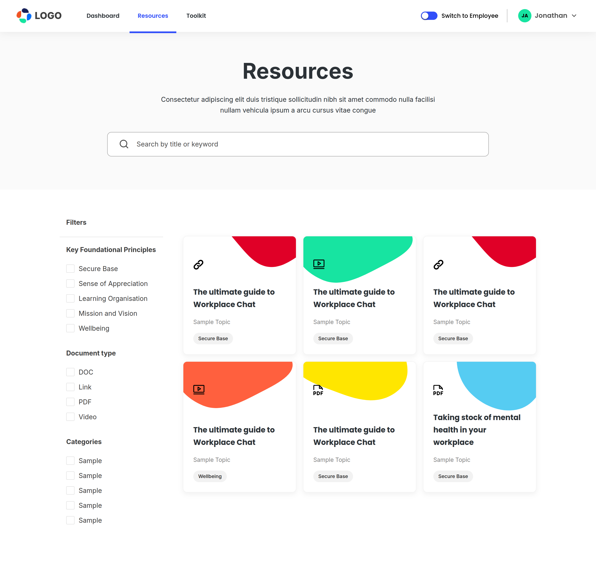

# Studio 14

Welcome to the Studio 14 repository!

This project is a modern web application built using <a href="https://nextjs.org" target="_blank">Next.js</a> and <a href="https://www.typescriptlang.org/" target="_blank">TypeScript</a>. It leverages the Chakra UI React component library for styling and UI components, and supports themes via `next-themes`. The homepage is available at <a href="https://michael-oyebadejo-studio-14.vercel.app" target="_blank">https://michael-oyebadejo-studio-14.vercel.app</a>.

## Table of Contents

- [Preview](#preview)
- [Technologies Used](#technologies-used)
- [Directory Structure](#directory-structure)
- [Configuration](#configuration)
- [Scripts](#scripts)
- [Dependencies](#dependencies)
- [Getting Started](#getting-started)
- [License](#license)
- [Author](#author)

## Preview

### Mobile


### Desktop


## Technologies Used

- **Next.js** (v15.x)
- **TypeScript**
- **React** (v19.x)
- **Chakra UI** (`@chakra-ui/react`)
- **Emotion** (`@emotion/react`)
- **React Toastify**
- **React Icons**
- **Jest** (Testing)
- **ESLint** (Linting)

## Directory Structure

- **src/**  
  Contains the main source code for the application.

- **public/**  
  Contains static assets served by Next.js, such as images and favicon.

## Configuration

- **next.config.ts**  
  Configures Next.js with experimental optimizations for Chakra UI imports.

  ```typescript
  const nextConfig = {
    experimental: {
      optimizePackageImports: ["@chakra-ui/react"],
    },
  };
  export default nextConfig;
  ```

## Scripts

The following npm scripts are available:

- `dev` — Start the development server
- `build` — Build for production (uses Turbopack)
- `start` — Start the production server
- `lint` — Run ESLint
- `test` — Run Jest tests
- `test:watch` — Run Jest tests in watch mode
- `test:coverage` — Run Jest tests with coverage reporting

## Dependencies

Main dependencies include:

- `@chakra-ui/react`
- `@emotion/react`
- `next`
- `next-themes`
- `react`
- `react-dom`
- `react-icons`
- `react-toastify`

Dev dependencies include:

- `@testing-library/react`
- `jest`
- `eslint`
- `typescript`
- and more.

## Getting Started

1. **Install dependencies:**
   ```bash
   nvm use #this uses the adviced node version 20.18

   npm install
   npm i @chakra-ui/cli
   npx @chakra-ui/cli snippet add
   ```
2. **Run the development server:**
   ```bash
   npm run dev
   ```

3. **Build for production:**
   ```bash
   npm run build
   npm start
   ```

## License

This project does not specify a license. Please add one if desired.

## Author

- [Michael Oye](https://github.com/Michaeloye)

---

> For more information, check out the [homepage](https://michael-oyebadejo-studio-14.vercel.app).